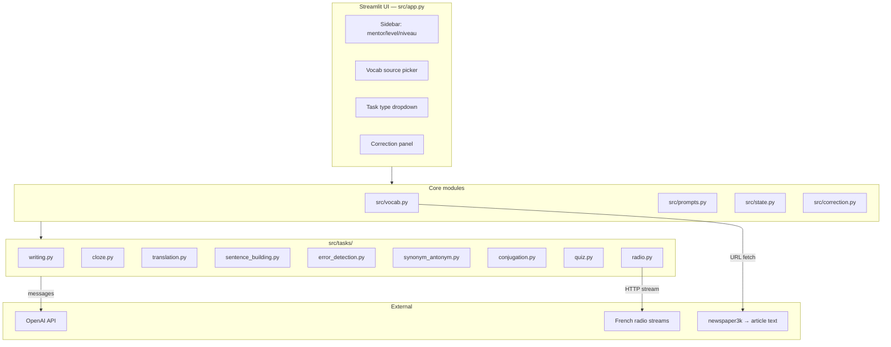

# Streamlit Showcase-Refactor Implementation Plan (Plan A / V1)

> **For agentic workers:** REQUIRED SUB-SKILL: Use superpowers:subagent-driven-development (recommended) or superpowers:executing-plans to implement this plan task-by-task. Steps use checkbox (`- [ ]`) syntax for tracking.

**Goal:** Das existierende 2025er Streamlit-Sprachlern-Tool (~619-Zeilen-Monolith) zu einer präsentablen, getesteten, dokumentierten Portfolio-Version refactoren und als privates GitHub-Repo pushen.

**Architecture:** Pragmatisches Refactoring des bestehenden Monolithen in fokussierte Module (`config`, `prompts`, `vocab`, `correction`, `tasks/`, `state`, `app`) ohne UX-Regression. Pure-Function-Tests für Prompt-Builder, Vokabel-Parsing und State-Transitions; OpenAI-Calls werden mit einem Fake-Client unit-getestet. Alte Dateien wandern in `archive/legacy/` statt gelöscht zu werden (per no-delete-archive-rule).

**Tech Stack:** Python 3.11+, Streamlit, OpenAI Python SDK (≥1.0), pytest, python-dotenv, newspaper3k, pyaudio/pydub/mutagen (Radio, local-only), prompt_toolkit (CLI). Kein neuer Stack — bestehende Libs behalten, nur disziplinieren.

**Scope-Ausschluss:** Next.js V2 / BYOK-Web ist ein separater Plan (Plan B, später). Hier nur Python/Streamlit.

**Linear-Ticket:** [TES-534](https://linear.app/test-dev-123/issue/TES-534/franz-lern-showcase-refactor-in-2-versionen-streamlit-nextjs-byok)

**GitHub-Repo (existiert leer, privat):** https://github.com/miraculix95/franz-lern

---

## File Structure (Zielbild)

```
franz-lern/
├── .env.example
├── .gitignore
├── README.md
├── requirements.txt
├── pyproject.toml                    # pytest + ruff config
├── CLAUDE.md                          # bleibt für Claude-Context
├── src/
│   ├── __init__.py
│   ├── app.py                        # Streamlit entrypoint (war franz-lern-streamlit.py)
│   ├── cli.py                        # War franz-lern.py
│   ├── config.py                     # Konstanten: levels, niveau_levels, mentoren, themen, models, languages, radio_kanale
│   ├── prompts.py                    # Alle Prompt-Templates als pure functions build_*_prompt
│   ├── state.py                      # SessionState dataclass
│   ├── vocab.py                      # load_vocabulary, extract_vocabulary, web_extract, generate_vocabulary
│   ├── correction.py                 # extract_comments, correct_text, answer_comments
│   ├── logging_setup.py              # logging-Config (ersetzt prints)
│   └── tasks/
│       ├── __init__.py
│       ├── base.py                   # Task Protocol + TaskResult type
│       ├── writing.py                # "Schreiben eines Textes"
│       ├── cloze.py                  # Lückentext
│       ├── translation.py            # Übersetzungs-Satz
│       ├── sentence_building.py      # Satzbau
│       ├── error_detection.py        # Fehler finden
│       ├── synonym_antonym.py        # Synonyme/Antonyme
│       ├── conjugation.py            # Verb-Konjugation
│       ├── quiz.py                   # Vokabel-Quiz (BUG gefixed)
│       └── radio.py                  # Radio-Diktat (Name gefixed, Disclaimer)
├── tests/
│   ├── __init__.py
│   ├── fake_openai.py                # Fake-Client für Unit-Tests
│   ├── test_config.py
│   ├── test_prompts.py
│   ├── test_vocab.py
│   ├── test_correction.py
│   ├── test_state.py
│   └── test_tasks/
│       ├── test_cloze.py
│       ├── test_translation.py
│       ├── test_quiz.py
│       └── ...
├── data/
│   └── sample_texts/                 # war txt/
├── experiments/
│   ├── verben_categorizer/           # war verben_test/
│   │   ├── DISCLAIMER.md
│   │   └── kategorisierung.py
│   └── webapp-fastapi-abandoned/     # war archiv_webapp_versuch/
│       ├── DISCLAIMER.md             # erklärt security-issues + Gründe für Archivierung
│       ├── backend/
│       ├── frontend/
│       └── documentation/
├── docs/
│   ├── PLAN.md                       # Link-File zu diesem Plan
│   ├── assets/
│   │   ├── hero-screenshot.png       # (manuell später eingefügt)
│   │   └── demo.gif                  # (optional, manuell später)
│   └── superpowers/plans/2026-04-20-streamlit-showcase-refactor.md  # dieses File
└── archive/
    └── legacy/                       # UNBERÜHRT: franz-lern-streamlit.py, franz-lern.py (originale)
        ├── franz-lern-streamlit.py
        ├── franz-lern.py
        └── out/                      # alte copy-Snapshots
```

**Out-of-Scope-Files (bleiben unverändert im Root):**
- `2025_03_20_wettbewerbsanalyse.xlsx` (Portfolio-Evidence — wird in README referenziert)
- `convertmp3mp4.py` (standalone Utility, kein Refactor nötig — bleibt im Root mit einer Zeile Kommentar)
- `.env` (von .gitignore erfasst, bleibt lokal)

---

## Bugs die auf dem Weg gefixt werden

Dokumentiert hier, damit keiner vergessen wird:

1. **Radio-Task-Name-Mismatch** — `task_list` hat `"Radio hören und aufnehmen"`, Handler checkt `"Radio hören und dann antworten"` → Task von UI nie erreichbar. Fix in Task 9.
2. **Vokabel-Quiz kaputt** — `answer = [], word = []` ist Tuple-Assignment nicht 2-Listen; `enumerate(quiz.items())` liefert 2-Tupel nicht 3; Button-Logik greift auf nicht-existente Keys zu. Fix in Task 14.
3. **argparse doppelt geparst** — `parser.parse_args()` zweimal in Folge, brittle. Fix in Task 18.
4. **Deprecated Model** — `generate_vocabulary_list` nutzt hardcoded `gpt-4-0613` (retired). Fix in Task 7.
5. **CWD-Abhängigkeit** — `web_extract_vocabulary` schreibt immer in `news_article.txt` im CWD. Fix: nach `tempfile` + in-memory returnen. Task 7.
6. **Transkription-Stub** — liest `radio_text.txt`, schreibt aber niemand. Stub-Hinweis + "known limitation" in Task 9.
7. **Prints statt Logging** — global, über alle Dateien. Fix parallel in jedem Refactor-Task via `logging_setup.py`.

---

## Testing Strategy

**Drei Test-Kategorien:**

1. **Pure-Function Tests** (schnell, viele): Prompt-Builder, Comment-Extraction, State-Transitions, Vocab-Parser. Kein Mock nötig.
2. **Fake-Client Tests** (moderat): Task-Funktionen bekommen statt `openai.OpenAI()` einen `FakeOpenAIClient` injected, der `messages` aufzeichnet. Assertions auf Prompt-Inhalt + Struktur, nicht auf echte Completions.
3. **Keine UI-Tests** (Cost>Benefit): Streamlit-AppTest ist unreif und Portfolio-Projekt muss nicht 100% getestet sein. Integrity-Test der App ist "manuell starten, Aufgaben durchklicken".

**Testing-Coverage-Ziel:** 70%+ der pure functions und task-generators. NICHT 100%, keine Sinnlos-Tests für Streamlit-Widget-Calls.

---

## Task 1: Git-Init + Baseline-Commit der Legacy

**Files:**
- Create: `.gitignore`
- Create: `.env.example`
- Move: alles bestehende in `archive/legacy/` (außer Excel, convertmp3mp4, .env, CLAUDE.md, docs/)

Ziel: Repo initialisieren, Legacy-Code als Commit #1 sichern **bevor** irgendwas refactored wird. Damit ist immer ein Rollback-Punkt da.

- [ ] **Step 1: Git init + remote ADD (noch nicht push)**

```bash
cd /home/claudeclaw/cc-dev/oldcode/2025_sprachlern_programm
git init -b main
git remote add origin https://github.com/miraculix95/franz-lern.git
```

Expected: `.git/` entsteht, `git remote -v` zeigt origin.

- [ ] **Step 2: .gitignore schreiben**

Create `.gitignore`:

```gitignore
# Python
__pycache__/
*.py[cod]
*$py.class
*.so
.Python
.venv/
venv/
env/
build/
dist/
*.egg-info/
.pytest_cache/
.ruff_cache/
.coverage
htmlcov/

# Secrets
.env
.env.local
*.key
users.db

# OS
.DS_Store
Thumbs.db

# Editor
.vscode/
.idea/
*.swp

# Project artifacts
out/*.py
news_article.txt
radio_text.txt
*.mp3
*.mp4
*.wav

# Legacy Windows SQLite DLL ZIP (not needed on this server)
sqlite-dll-win-x64-*.zip
sqlite-dll-win-x64-*/
```

- [ ] **Step 3: .env.example schreiben**

Create `.env.example`:

```
# Required — get from https://platform.openai.com/api-keys
OPENAI_API_KEY=sk-...

# Optional — only if web-scraping feature is used (newspaper3k has no key)
# No other keys needed for basic functionality.
```

- [ ] **Step 4: Legacy-Dateien in archive/legacy/ verschieben**

```bash
mkdir -p archive/legacy
git mv franz-lern-streamlit.py archive/legacy/
git mv franz-lern.py archive/legacy/
mv out archive/legacy/
```

Expected: `ls archive/legacy/` zeigt `franz-lern-streamlit.py`, `franz-lern.py`, `out/`.

- [ ] **Step 5: Baseline-Commit**

```bash
git add .gitignore .env.example archive/ CLAUDE.md docs/ 2025_03_20_wettbewerbsanalyse.xlsx convertmp3mp4.py txt/ verben_test/ archiv_webapp_versuch/
git status
git commit -m "chore: baseline — archive legacy code, add gitignore and env.example"
```

Expected: Commit erfolgreich, `.env` nicht eingecheckt.

---

## Task 2: Neue Ordner-Struktur + Python-Projekt-Setup

**Files:**
- Create: `pyproject.toml`
- Create: `requirements.txt`
- Create: `src/__init__.py`, `tests/__init__.py`, `src/tasks/__init__.py`, `tests/test_tasks/__init__.py`
- Move: `txt/` → `data/sample_texts/`
- Move: `verben_test/` → `experiments/verben_categorizer/`
- Move: `archiv_webapp_versuch/` → `experiments/webapp-fastapi-abandoned/`

- [ ] **Step 1: Ordner-Struktur anlegen**

```bash
mkdir -p src/tasks tests/test_tasks data experiments docs/assets
touch src/__init__.py src/tasks/__init__.py tests/__init__.py tests/test_tasks/__init__.py
git mv txt data/sample_texts
git mv verben_test experiments/verben_categorizer
git mv archiv_webapp_versuch experiments/webapp-fastapi-abandoned
```

- [ ] **Step 2: DISCLAIMER.md für webapp-abandoned schreiben**

Create `experiments/webapp-fastapi-abandoned/DISCLAIMER.md`:

```markdown
# ⚠️ Abandoned Experiment — Do Not Use

This folder is an early-2025 attempt to port the Streamlit app to a FastAPI + sqlite web service. It was **abandoned** because the architecture took a direction we did not want to pursue (auth/credits system), and the implementation has multiple security foot-guns that should never see production.

## Known issues (intentionally not fixed — file is archived as-is for portfolio honesty)

- `SECRET_KEY = "supersecret"` is hardcoded in `backend/main.py`
- Passwords are stored in **plaintext** in `users.db` (`backend/database.py`)
- JWTs are created with `expires = datetime.now()` — they are always already expired
- CORS is configured `allow_origins=["*"]` **with** `allow_credentials=True`, which browsers reject
- `init_db()` is called from both `database.py` and `main.py`
- Windows-x64 SQLite DLLs shipped in the folder (irrelevant on Linux servers)

## Why it's kept in the repo

Portfolio honesty: showing what was tried and why it was stopped is more informative
than pretending only the successful path existed. The Streamlit version (in `src/`) is
the surviving, maintained implementation.
```

- [ ] **Step 3: DISCLAIMER.md für verben_categorizer schreiben**

Create `experiments/verben_categorizer/DISCLAIMER.md`:

```markdown
# Verben Categorizer — Standalone Experiment

One-shot LangChain utility that proposes semantic categories for a list of French verbs
and sorts the verbs into them. Independent from the main Streamlit app — kept as a
separate experiment.

**Run:** `python kategorisierung.py` (reads `franz-verben.txt`, writes `franz-verben_sortiert.json`)

**Dependencies:** `langchain`, `langchain-openai` (not in the main `requirements.txt`).
```

- [ ] **Step 4: pyproject.toml schreiben**

Create `pyproject.toml`:

```toml
[build-system]
requires = ["setuptools>=61.0"]
build-backend = "setuptools.build_meta"

[project]
name = "franz-lern"
version = "0.2.0"
description = "AI-powered French/multilingual language tutor built on Streamlit and GPT."
requires-python = ">=3.11"

[tool.pytest.ini_options]
testpaths = ["tests"]
python_files = ["test_*.py"]
addopts = "-v --tb=short"

[tool.ruff]
line-length = 110
target-version = "py311"

[tool.ruff.lint]
select = ["E", "F", "W", "I", "B", "UP"]
ignore = ["E501"]  # line length handled separately
```

- [ ] **Step 5: requirements.txt schreiben**

Create `requirements.txt`:

```
streamlit>=1.30
openai>=1.10
python-dotenv>=1.0
newspaper3k>=0.2.8
lxml_html_clean>=0.1  # newspaper3k dependency on newer lxml
requests>=2.31
prompt_toolkit>=3.0
# Radio/Audio (local-only, optional)
pyaudio>=0.2.14
pydub>=0.25
mutagen>=1.47
# Dev/test
pytest>=8.0
ruff>=0.3
```

- [ ] **Step 6: Commit**

```bash
git add pyproject.toml requirements.txt src/ tests/ data/ experiments/ docs/
git commit -m "chore: scaffold new src/tests/data/experiments layout"
```

---

## Task 3: `src/config.py` — Konstanten extrahieren (+ Tests)

**Files:**
- Create: `src/config.py`
- Create: `tests/test_config.py`

- [ ] **Step 1: Test schreiben**

Create `tests/test_config.py`:

```python
from src.config import (
    LEVELS, NIVEAU_LEVELS, LANGUAGES, MENTORS, THEMES, MODELS,
    RADIO_CHANNELS, DEFAULT_MODEL, DEFAULT_LANGUAGE,
)


def test_levels_are_cefr():
    assert LEVELS == ["A1", "A2", "B1", "B2", "C1", "C2"]


def test_languages_contain_core_set():
    for lang in ["französisch", "englisch", "spanisch", "deutsch"]:
        assert lang in LANGUAGES


def test_default_model_is_in_models_list():
    assert DEFAULT_MODEL in MODELS


def test_default_language_is_in_languages():
    assert DEFAULT_LANGUAGE in LANGUAGES


def test_radio_channels_have_urls():
    assert "France Info" in RADIO_CHANNELS
    assert RADIO_CHANNELS["France Info"].startswith("http")


def test_niveau_levels_spans_register_range():
    assert "Standardsprache" in NIVEAU_LEVELS
    assert "Technisch" in NIVEAU_LEVELS


def test_mentors_list_not_empty():
    assert len(MENTORS) >= 5


def test_themes_list_not_empty():
    assert len(THEMES) >= 5


def test_no_deprecated_models():
    # gpt-4-0613 was retired; gpt-3.5-turbo-0125 has a 2026 EOL
    assert "gpt-4-0613" not in MODELS
```

- [ ] **Step 2: Run test — expect ImportError/fail**

```bash
cd /home/claudeclaw/cc-dev/oldcode/2025_sprachlern_programm
pytest tests/test_config.py -v
```

Expected: FAIL (ModuleNotFoundError `src.config`).

- [ ] **Step 3: Implement src/config.py**

Create `src/config.py`:

```python
"""Static configuration constants for franz-lern.

Everything that used to be top-of-file globals in franz-lern-streamlit.py lives
here. Kept pure (no imports beyond stdlib) so tests stay fast.
"""
from __future__ import annotations

LEVELS: list[str] = ["A1", "A2", "B1", "B2", "C1", "C2"]

NIVEAU_LEVELS: list[str] = [
    "Gossensprache/Kriminelle Sprache",
    "Argot/Vulgär",
    "Umgangssprache",
    "Standardsprache",
    "Gehoben/Vornehm",
    "Hohe Literatur",
    "Technisch",
]

LANGUAGES: list[str] = [
    "französisch",
    "englisch",
    "spanisch",
    "ukrainisch",
    "deutsch",
]

MENTORS: list[str] = [
    "Netter Lehrer",
    "Strenger Lehrer",
    "Dalai Lama",
    "Vitalik Buterin",
    "Elon Musk",
    "Jesus Christus",
    "Chairman Mao",
    "Homer",
    "Konfuzius",
    "Machiavelli",
]

THEMES: list[str] = [
    "Urlaub",
    "Schule",
    "Essen",
    "Sport",
    "Kultur",
    "Medien",
    "Raumfahrt",
    "Business",
    "Politik",
]

MODELS: list[str] = [
    "gpt-4o-mini",
    "gpt-4o",
    "gpt-4-turbo",
]

DEFAULT_MODEL: str = "gpt-4o-mini"
DEFAULT_LANGUAGE: str = "französisch"

RADIO_CHANNELS: dict[str, str] = {
    "France Info": "http://icecast.radiofrance.fr/franceinfo-midfi.mp3",
    "France Inter": "http://icecast.radiofrance.fr/franceinter-midfi.mp3",
    "France Culture": "http://icecast.radiofrance.fr/franceculture-midfi.mp3",
    "BFM Radio": "https://audio.bfmtv.com/bfmradio_128.mp3",
}

TASK_LIST: list[str] = [
    "",
    "Schreiben eines Textes und danach Korrektur",
    "Ausfüllen eines Lückentextes in Fremdsprache",
    "Vorgabe von deutschen Sätzen zum Übersetzen",
    "Vokabel-Quiz",
    "Satzbauübung",
    "Fehler im Text finden und korrigieren",
    "Synonyme und Antonyme finden",
    "Verbkonjugation üben",
    "Radio hören und aufnehmen",
]

NO_ANSWERS_HINT: str = " Nenne nicht die Antworten. "
```

- [ ] **Step 4: Run test — expect PASS**

```bash
pytest tests/test_config.py -v
```

Expected: all 9 tests PASS.

- [ ] **Step 5: Commit**

```bash
git add src/config.py tests/test_config.py
git commit -m "refactor: extract constants into src/config.py with tests"
```

---

## Task 4: `src/logging_setup.py` — Logging statt Prints

**Files:**
- Create: `src/logging_setup.py`
- Create: `tests/test_logging_setup.py`

- [ ] **Step 1: Test schreiben**

Create `tests/test_logging_setup.py`:

```python
import logging

from src.logging_setup import get_logger, configure_logging


def test_get_logger_returns_logger():
    log = get_logger("test")
    assert isinstance(log, logging.Logger)


def test_configure_logging_sets_level(caplog):
    configure_logging(level="DEBUG")
    log = get_logger("test_debug")
    with caplog.at_level(logging.DEBUG, logger="test_debug"):
        log.debug("hello")
    assert any("hello" in r.message for r in caplog.records)


def test_configure_logging_defaults_to_info():
    configure_logging()
    assert logging.getLogger().level == logging.INFO
```

- [ ] **Step 2: Run — expect FAIL**

```bash
pytest tests/test_logging_setup.py -v
```

- [ ] **Step 3: Implement src/logging_setup.py**

Create `src/logging_setup.py`:

```python
"""Central logging configuration.

Replaces the scattered `print(...)` calls from the legacy Monolith. Streamlit
sessions write to stderr by default; keeping one format makes the run log
actually readable.
"""
from __future__ import annotations

import logging
import os

_CONFIGURED = False


def configure_logging(level: str | int | None = None) -> None:
    global _CONFIGURED
    if _CONFIGURED:
        return
    lvl = level or os.environ.get("LOG_LEVEL", "INFO")
    logging.basicConfig(
        level=lvl,
        format="%(asctime)s [%(levelname)s] %(name)s: %(message)s",
        datefmt="%H:%M:%S",
    )
    _CONFIGURED = True


def get_logger(name: str) -> logging.Logger:
    configure_logging()
    return logging.getLogger(name)
```

- [ ] **Step 4: Run — expect PASS**

```bash
pytest tests/test_logging_setup.py -v
```

- [ ] **Step 5: Commit**

```bash
git add src/logging_setup.py tests/test_logging_setup.py
git commit -m "feat: add central logging setup to replace print statements"
```

---

## Task 5: `tests/fake_openai.py` — Test-Double für OpenAI-Client

**Files:**
- Create: `tests/fake_openai.py`
- Create: `tests/test_fake_openai.py`

Ziel: Recording-Client mit `client.chat.completions.create(...)`-Interface, der nicht wirklich die API callt.

- [ ] **Step 1: Test des Fake-Clients schreiben**

Create `tests/test_fake_openai.py`:

```python
from tests.fake_openai import FakeOpenAIClient


def test_fake_returns_configured_content():
    client = FakeOpenAIClient(responses=["hello back"])
    result = client.chat.completions.create(
        model="gpt-4o-mini",
        messages=[{"role": "user", "content": "hi"}],
    )
    assert result.choices[0].message.content == "hello back"


def test_fake_records_call_arguments():
    client = FakeOpenAIClient(responses=["ok"])
    client.chat.completions.create(
        model="gpt-4o-mini",
        messages=[{"role": "user", "content": "hi"}],
    )
    assert len(client.calls) == 1
    assert client.calls[0]["model"] == "gpt-4o-mini"
    assert client.calls[0]["messages"][0]["content"] == "hi"


def test_fake_cycles_through_responses():
    client = FakeOpenAIClient(responses=["a", "b"])
    r1 = client.chat.completions.create(model="x", messages=[])
    r2 = client.chat.completions.create(model="x", messages=[])
    assert r1.choices[0].message.content == "a"
    assert r2.choices[0].message.content == "b"


def test_fake_supports_function_call_arguments():
    client = FakeOpenAIClient(responses=[{"function_arguments": '{"vocabulary": ["a","b"]}'}])
    r = client.chat.completions.create(model="x", messages=[])
    assert r.choices[0].message.function_call.arguments == '{"vocabulary": ["a","b"]}'
```

- [ ] **Step 2: Run — expect FAIL**

- [ ] **Step 3: Implement tests/fake_openai.py**

Create `tests/fake_openai.py`:

```python
"""Minimal record-and-replay double for openai.OpenAI.

Matches the shape used by the codebase:
    client.chat.completions.create(model=..., messages=..., ...)

Each response can be:
- a plain string -> goes into choices[0].message.content
- a dict with key "function_arguments" -> goes into choices[0].message.function_call.arguments
"""
from __future__ import annotations

from dataclasses import dataclass, field
from typing import Any


@dataclass
class _Message:
    content: str | None = None
    function_call: Any = None


@dataclass
class _FunctionCall:
    arguments: str


@dataclass
class _Choice:
    message: _Message


@dataclass
class _Response:
    choices: list[_Choice]


@dataclass
class _CompletionsAPI:
    parent: "FakeOpenAIClient"

    def create(self, **kwargs: Any) -> _Response:
        self.parent.calls.append(kwargs)
        idx = self.parent._cursor % len(self.parent.responses)
        self.parent._cursor += 1
        raw = self.parent.responses[idx]
        if isinstance(raw, str):
            return _Response([_Choice(_Message(content=raw))])
        if isinstance(raw, dict) and "function_arguments" in raw:
            return _Response(
                [_Choice(_Message(function_call=_FunctionCall(arguments=raw["function_arguments"])))]
            )
        raise TypeError(f"Unsupported response type: {type(raw)}")


@dataclass
class _ChatAPI:
    completions: _CompletionsAPI


@dataclass
class FakeOpenAIClient:
    responses: list[Any]
    calls: list[dict] = field(default_factory=list)
    _cursor: int = 0
    chat: _ChatAPI = field(init=False)

    def __post_init__(self) -> None:
        self.chat = _ChatAPI(completions=_CompletionsAPI(parent=self))
```

- [ ] **Step 4: Run — expect PASS**

- [ ] **Step 5: Commit**

```bash
git add tests/fake_openai.py tests/test_fake_openai.py
git commit -m "test: add FakeOpenAIClient for offline task-generator tests"
```

---

## Task 6: `src/prompts.py` — Prompt-Builder extrahieren (+ Tests)

**Files:**
- Create: `src/prompts.py`
- Create: `tests/test_prompts.py`

Ziel: Alle Prompts aus dem Legacy-Monolith als **pure functions** die Strings zurückgeben. Kein API-Call, keine Streamlit-Referenzen.

- [ ] **Step 1: Test schreiben**

Create `tests/test_prompts.py`:

```python
from src.prompts import (
    build_vocab_extract_prompt,
    build_vocab_autogen_prompt,
    build_cloze_system_prompt,
    build_cloze_user_prompt,
    build_translation_prompt,
    build_sentence_building_prompt,
    build_error_detection_prompt,
    build_conjugation_prompt,
    build_correction_prompt,
    build_answer_comment_prompt,
    VOCAB_FUNCTION_SPEC,
)


def test_vocab_extract_prompt_includes_level_and_count():
    p = build_vocab_extract_prompt(language="französisch", level="B2", number=30)
    assert "B2" in p
    assert "30" in p
    assert "französisch" in p


def test_vocab_autogen_prompt_includes_niveau():
    p = build_vocab_autogen_prompt(language="französisch", level="B1", niveau="Technisch")
    assert "B1" in p
    assert "Technisch" in p


def test_cloze_prompts_include_number_trous():
    sys = build_cloze_system_prompt(language="französisch")
    user = build_cloze_user_prompt(
        language="französisch", level="B2", niveau="Standardsprache",
        selected_vocab=["maison", "voiture"], number_trous=4,
    )
    assert "Lückentext" in sys or "Lücken" in sys
    assert "4" in user
    assert "maison" in user


def test_translation_prompt_includes_sentences_count():
    p = build_translation_prompt(
        language="französisch", level="B1", niveau="Standardsprache",
        selected_vocab=["manger"], number_sentences=3,
    )
    assert "3" in p
    assert "manger" in p


def test_correction_prompt_includes_mentor_persona():
    p = build_correction_prompt(
        language="französisch", niveau="Standardsprache", mentor="Machiavelli",
        task="Schreibe einen Text", user_text="Je suis",
    )
    assert "Machiavelli" in p[0]["content"]
    assert "Je suis" in p[1]["content"]


def test_answer_comment_prompt_is_messages_list():
    msgs = build_answer_comment_prompt("Was ist passé composé?")
    assert isinstance(msgs, list)
    assert msgs[-1]["role"] == "user"
    assert "passé composé" in msgs[-1]["content"]


def test_vocab_function_spec_has_required_keys():
    assert VOCAB_FUNCTION_SPEC["name"] == "generate_vocabulary_list"
    assert "vocabulary" in VOCAB_FUNCTION_SPEC["parameters"]["properties"]
```

- [ ] **Step 2: Run — expect FAIL**

- [ ] **Step 3: Implement src/prompts.py**

Create `src/prompts.py`:

```python
"""Prompt templates as pure functions.

Every function returns either a plain prompt string or a full `messages` list
ready to pass to `openai.chat.completions.create`. No side effects, no I/O.
"""
from __future__ import annotations

from src.config import NO_ANSWERS_HINT


VOCAB_FUNCTION_SPEC: dict = {
    "name": "generate_vocabulary_list",
    "description": "Generiert eine Liste Vokabeln mit Verben.",
    "parameters": {
        "type": "object",
        "properties": {
            "vocabulary": {
                "type": "array",
                "items": {"type": "string"},
                "description": "Eine Liste von Vokabeln.",
            }
        },
        "required": ["vocabulary"],
    },
}


def build_vocab_extract_prompt(*, language: str, level: str, number: int) -> str:
    return (
        f"Du bist ein Sprachlehrer. Extrahiere genau {number} {language}e Vokabeln "
        f"oder Redewendungen passend zum Mindest-Sprachniveau {level} aus dem folgenden "
        f"Text. Erstelle dabei eine gute Mischung aus Verben, komplexen Ausdrücken, "
        f"Adjektiven und Nomen. Vermeide Eigennamen und geographische Namen. "
        f"Gib die Vokabeln als durch Kommas getrennte Liste ohne Nummerierung zurück. "
        f"Gib das Ergebnis ohne Einleitung und Kommentar an."
    )


def build_vocab_autogen_prompt(*, language: str, level: str, niveau: str) -> str:
    return (
        f"Erstelle in Python-Format eine Liste von 20 {language}n Vokabeln inklusive "
        f"Verben. Die Sprache ist {language}. Die Wörter sollen passend zum Mindest-"
        f"Sprachniveau {level} sein, das folgende Sprachregister treffen: {niveau}. "
        f"Wähle thematisch zueinander passende Wörter aus."
    )


def build_cloze_system_prompt(*, language: str) -> str:
    return (
        f"Du bist ein Sprachlehrer. Deine Aufgabe ist es, dem Benutzer bei der "
        f"Erstellung von Lückentexten in der Sprache {language} zu helfen. Der Text "
        f"soll Vokabeln enthalten, die im angegebenen Kontext verwendet werden, wobei "
        f"jedes Wort genau einmal vorkommt. Die Lücken sollen so gesetzt werden, dass "
        f"der Benutzer sie mit den entsprechenden Vokabeln ausfüllen muss. Die "
        f"Vokabeln können in ihrer Grundform oder in abgewandelter Form (Plural, "
        f"Konjugation) vorkommen. Der Text soll dem Sprachlevel des Benutzers "
        f"entsprechen, das im User-Prompt angegeben ist. Der Text muss ohne die "
        f"Lösungen (Lücke-Verb-Zuordnung) ausgegeben werden, und ein passender Titel "
        f"soll hinzugefügt werden. Der Text soll logisch Sinn machen."
    )


def build_cloze_user_prompt(
    *, language: str, level: str, niveau: str,
    selected_vocab: list[str], number_trous: int,
) -> str:
    joined = ", ".join(selected_vocab)
    return (
        f"Erstelle bitte einen Lückentext der {language}en Sprache mit den folgenden "
        f"Vokabeln: {joined}. Der Text muss auf dem Sprachlevel {level} sein, das "
        f"folgende Sprachregister treffen: {niveau}, und genau {number_trous} Lücken "
        f"enthalten. Vor dem eigentlichen Lückentext müssen die Bedeutungen der "
        f"Vokabeln zwingend jeweils ganz kurz erklärt werden. Jede Lücke soll eine der "
        f"Vokabeln ersetzen. Gib den Lückentext ohne Lösungen aus und füge einen "
        f"passenden Titel hinzu."
    )


def build_translation_prompt(
    *, language: str, level: str, niveau: str,
    selected_vocab: list[str], number_sentences: int,
) -> str:
    joined = ", ".join(selected_vocab)
    return (
        f"Übersetze die folgenden {language}en Vokabeln ins Deutsche: {joined}. "
        f"Erstelle dann {number_sentences} deutsche Sätze zum Übersetzen ins "
        f"{language}e für das Sprachregister {niveau} und das Sprachlevel {level}. "
        f"Gib die Lösung (die {language}en Sätze) nicht an.{NO_ANSWERS_HINT}"
        f"\n\nAusgabeformat:\nÜbersetze die Sätze: nummeriert.\n---\n"
        f"Benutze die folgenden Vokabeln ({language} - deutsch): als Bulletpoints."
    )


def build_sentence_building_prompt(
    *, language: str, level: str, niveau: str, selected_vocab: list[str],
) -> str:
    words = ", ".join(selected_vocab)
    return (
        f"Erstelle einen {language}en Satz mit den folgenden Wörtern: {words}. "
        f"Benutze dabei das folgende Sprachregister: {niveau} und das folgende "
        f"Sprachlevel: {level}.{NO_ANSWERS_HINT}"
    )


def build_error_detection_prompt(
    *, language: str, level: str, niveau: str, selected_vocab: list[str],
) -> str:
    joined = ", ".join(selected_vocab)
    return (
        f"Erstelle 3 grammatikalisch und orthografisch stark fehlerhafte {language}e "
        f"Sätze mit dem folgenden Sprachregister: {niveau} mit den folgenden Vokabeln, "
        f"die für einen Lernenden des Sprachlevels {level} verständlich sind. "
        f"Gib die korrekten Sätze nicht an: {joined}."
    )


def build_conjugation_prompt(*, language: str, level: str, vocab_list: list[str]) -> list[dict]:
    joined = ", ".join(vocab_list)
    return [
        {"role": "system", "content": "Gib einwortige Antworten wann immer möglich, ohne Nummerierung, ohne Punkt."},
        {
            "role": "user",
            "content": (
                f"Wähle passend zum Sprachlevel {level} entweder a) zufällig ein Verb "
                f"aus der angehängten Vokabelliste aus: {joined}, oder b) ein beliebiges "
                f"unregelmäßiges Verb. Es muss ein Verb (Tunwort) sein."
            ),
        },
    ]


def build_correction_prompt(
    *, language: str, niveau: str, mentor: str, task: str, user_text: str,
) -> list[dict]:
    return [
        {
            "role": "system",
            "content": (
                f"Korrigiere den folgenden {language}en Text. Beachte die Aufgabenstellung. "
                f"Beachte, dass der Nutzer das folgende Sprachregister benutzt: {niveau}. "
                f"Erkläre dem Benutzer seine Fehler und gib Feedback im Stile von {mentor}. "
                f"Nicht pingelig wegen des Ausdrucks sein. Halte dich kurz."
            ),
        },
        {"role": "user", "content": f"Aufgabe: {task}\n\nAntwort des Benutzers: {user_text}"},
    ]


def build_answer_comment_prompt(comment: str) -> list[dict]:
    return [
        {"role": "system", "content": "Beantworte die folgende Frage sachlich und präzise."},
        {"role": "user", "content": comment},
    ]
```

- [ ] **Step 4: Run — expect PASS**

- [ ] **Step 5: Commit**

```bash
git add src/prompts.py tests/test_prompts.py
git commit -m "refactor: extract all prompts into src/prompts.py as pure builders"
```

---

## Task 7: `src/vocab.py` — Vokabel-Extraktion mit Tempfile-Fix

**Files:**
- Create: `src/vocab.py`
- Create: `tests/test_vocab.py`

Fixt den CWD-Bug: `web_extract_vocabulary` schreibt nach `tempfile`, gibt Text als String zurück.

- [ ] **Step 1: Test schreiben**

Create `tests/test_vocab.py`:

```python
import json

from src.vocab import load_vocabulary, extract_vocabulary_from_text, generate_vocabulary_via_function_call
from tests.fake_openai import FakeOpenAIClient


def test_load_vocabulary_from_file(tmp_path):
    path = tmp_path / "vocab.txt"
    path.write_text("maison\nvoiture\n  chaise  \n", encoding="utf-8")
    result = load_vocabulary(str(path))
    assert result == ["maison", "voiture", "chaise"]


def test_extract_vocabulary_returns_trimmed_list():
    fake = FakeOpenAIClient(responses=["maison, voiture ,   chaise"])
    result = extract_vocabulary_from_text(
        fake, text="Un texte quelconque.", language="französisch", level="B1", number=3,
        model="gpt-4o-mini",
    )
    assert result == ["maison", "voiture", "chaise"]


def test_extract_vocabulary_records_user_message():
    fake = FakeOpenAIClient(responses=["a, b"])
    extract_vocabulary_from_text(
        fake, text="Texte.", language="französisch", level="B2", number=10,
        model="gpt-4o-mini",
    )
    messages = fake.calls[0]["messages"]
    assert any("B2" in m["content"] for m in messages)
    assert any("Texte." == m["content"] for m in messages)


def test_generate_vocabulary_via_function_call_parses_json():
    fake = FakeOpenAIClient(responses=[{"function_arguments": json.dumps({"vocabulary": ["a", "b", "c"]})}])
    result = generate_vocabulary_via_function_call(
        fake, language="französisch", level="B1", niveau="Standardsprache", model="gpt-4o-mini",
    )
    assert result == ["a", "b", "c"]
```

- [ ] **Step 2: Run — expect FAIL**

- [ ] **Step 3: Implement src/vocab.py**

Create `src/vocab.py`:

```python
"""Vocabulary loading and extraction.

Three sources:
- load_vocabulary: read a .txt file of one-word-per-line vocabulary
- extract_vocabulary_from_text: ask the LLM to extract N vocabs from given text
- generate_vocabulary_via_function_call: ask the LLM to invent a vocab list
- fetch_article_text: fetch+parse a URL (returns text, no disk write)
"""
from __future__ import annotations

import json
from typing import Any

from src.logging_setup import get_logger
from src.prompts import (
    VOCAB_FUNCTION_SPEC,
    build_vocab_autogen_prompt,
    build_vocab_extract_prompt,
)

log = get_logger(__name__)


def load_vocabulary(file_path: str) -> list[str]:
    with open(file_path, "r", encoding="utf-8") as f:
        return [line.strip() for line in f if line.strip()]


def extract_vocabulary_from_text(
    client: Any,
    *,
    text: str,
    language: str,
    level: str,
    number: int,
    model: str,
) -> list[str]:
    system = build_vocab_extract_prompt(language=language, level=level, number=number)
    response = client.chat.completions.create(
        model=model,
        messages=[
            {"role": "system", "content": system},
            {"role": "user", "content": text},
        ],
    )
    raw = response.choices[0].message.content.strip()
    return [v.strip() for v in raw.split(",") if v.strip()]


def generate_vocabulary_via_function_call(
    client: Any, *, language: str, level: str, niveau: str, model: str,
) -> list[str]:
    user_prompt = build_vocab_autogen_prompt(language=language, level=level, niveau=niveau)
    response = client.chat.completions.create(
        model=model,
        messages=[
            {"role": "system", "content": "Du bist ein Sprachlehrer."},
            {"role": "user", "content": user_prompt},
        ],
        functions=[VOCAB_FUNCTION_SPEC],
        function_call={"name": "generate_vocabulary_list"},
    )
    args_json = response.choices[0].message.function_call.arguments
    return json.loads(args_json)["vocabulary"]


def fetch_article_text(url: str) -> str:
    """Download and parse a news article URL, return title+summary+body as one string.

    Uses newspaper3k. Returns in-memory string — no disk writes (fixing the legacy
    CWD-dependency bug).
    """
    from newspaper import Article  # imported lazily: heavy dep

    article = Article(url)
    article.download()
    article.parse()
    return f"{article.title}\n\n{article.summary}\n\n{article.text}"
```

- [ ] **Step 4: Run — expect PASS**

- [ ] **Step 5: Commit**

```bash
git add src/vocab.py tests/test_vocab.py
git commit -m "refactor: extract vocab logic, fix CWD dependency in web scrape"
```

---

## Task 8: `src/correction.py` — Kommentar-Extraktion + Text-Korrektur

**Files:**
- Create: `src/correction.py`
- Create: `tests/test_correction.py`

- [ ] **Step 1: Test schreiben**

Create `tests/test_correction.py`:

```python
from src.correction import extract_comments, correct_text, answer_comment
from tests.fake_openai import FakeOpenAIClient


def test_extract_comments_splits_angle_brackets():
    text = "Bonjour <was heißt bonjour?> je vais bien <ist das Passé Composé?>"
    cleaned, comments = extract_comments(text)
    assert cleaned == "Bonjour  je vais bien"
    assert comments == ["was heißt bonjour?", "ist das Passé Composé?"]


def test_extract_comments_handles_no_comments():
    text = "Bonjour je vais bien"
    cleaned, comments = extract_comments(text)
    assert cleaned == "Bonjour je vais bien"
    assert comments == []


def test_correct_text_passes_mentor_to_prompt():
    fake = FakeOpenAIClient(responses=["corrigé"])
    result = correct_text(
        fake, task="Schreibe etwas", user_text="Je suis", language="französisch",
        niveau="Standardsprache", mentor="Machiavelli", model="gpt-4o-mini",
    )
    assert result == "corrigé"
    sys_content = fake.calls[0]["messages"][0]["content"]
    assert "Machiavelli" in sys_content


def test_answer_comment_returns_response():
    fake = FakeOpenAIClient(responses=["Das bedeutet Hallo"])
    result = answer_comment(fake, comment="Was heißt bonjour?", model="gpt-4o-mini")
    assert result == "Das bedeutet Hallo"
```

- [ ] **Step 2: Run — expect FAIL**

- [ ] **Step 3: Implement src/correction.py**

Create `src/correction.py`:

```python
"""Text correction and comment handling.

Legacy-behavior: users can embed <meta-questions> in angle brackets; those get
extracted, answered separately, and the cleaned text is fed to the corrector.
"""
from __future__ import annotations

import re
from typing import Any

from src.prompts import build_answer_comment_prompt, build_correction_prompt

_COMMENT_RE = re.compile(r"<(.*?)>")


def extract_comments(text: str) -> tuple[str, list[str]]:
    comments = _COMMENT_RE.findall(text)
    cleaned = _COMMENT_RE.sub("", text).strip()
    return cleaned, comments


def correct_text(
    client: Any, *, task: str, user_text: str, language: str, niveau: str,
    mentor: str, model: str,
) -> str:
    messages = build_correction_prompt(
        language=language, niveau=niveau, mentor=mentor, task=task, user_text=user_text,
    )
    response = client.chat.completions.create(model=model, messages=messages)
    return response.choices[0].message.content.strip()


def answer_comment(client: Any, *, comment: str, model: str) -> str:
    messages = build_answer_comment_prompt(comment)
    response = client.chat.completions.create(model=model, messages=messages)
    return response.choices[0].message.content.strip()
```

- [ ] **Step 4: Run — expect PASS**

- [ ] **Step 5: Commit**

```bash
git add src/correction.py tests/test_correction.py
git commit -m "refactor: extract comment/correction logic with tests"
```

---

## Task 9: `src/tasks/base.py` — Task-Protocol

**Files:**
- Create: `src/tasks/base.py`
- Create: `tests/test_tasks/__init__.py`

Definiert den gemeinsamen Vertrag aller Task-Module: jedes Task hat eine `build(...)`-Funktion die `TaskInstruction` liefert — ein Dataclass mit `intro_text` und `displayed_to_user: str`.

- [ ] **Step 1: Implement src/tasks/base.py** (Protokoll — kein separater Test nötig, wird durch die nachfolgenden Task-Tests geprüft)

Create `src/tasks/base.py`:

```python
"""Task-module protocol.

Every concrete task (cloze, translation, …) exports a function
`build(client, **params) -> TaskInstruction`. The returned object carries
everything the UI needs to render the exercise.
"""
from __future__ import annotations

from dataclasses import dataclass


@dataclass
class TaskInstruction:
    displayed_to_user: str
    internal_context: dict | None = None
```

- [ ] **Step 2: Commit**

```bash
git add src/tasks/base.py
git commit -m "refactor: define TaskInstruction dataclass for task modules"
```

---

## Task 10: `src/tasks/writing.py` — Text-Schreib-Aufgabe

**Files:**
- Create: `src/tasks/writing.py`
- Create: `tests/test_tasks/test_writing.py`

- [ ] **Step 1: Test schreiben**

Create `tests/test_tasks/test_writing.py`:

```python
from src.tasks.writing import build


def test_build_returns_task_with_theme():
    result = build(themes=["Urlaub", "Sport"], previous_theme="Sport")
    assert "Urlaub" in result.displayed_to_user
    assert result.internal_context["theme"] == "Urlaub"


def test_build_avoids_previous_theme():
    result = build(themes=["A", "B"], previous_theme="A")
    assert result.internal_context["theme"] == "B"


def test_build_picks_from_all_when_no_previous():
    result = build(themes=["A", "B", "C"], previous_theme="")
    assert result.internal_context["theme"] in ["A", "B", "C"]
```

- [ ] **Step 2: Run — expect FAIL**

- [ ] **Step 3: Implement src/tasks/writing.py**

Create `src/tasks/writing.py`:

```python
from __future__ import annotations

import random

from src.tasks.base import TaskInstruction


def build(*, themes: list[str], previous_theme: str) -> TaskInstruction:
    candidates = [t for t in themes if t != previous_theme]
    theme = random.choice(candidates or themes)
    return TaskInstruction(
        displayed_to_user=f"Schreibe einen Text über das Thema: {theme}",
        internal_context={"theme": theme},
    )
```

- [ ] **Step 4: Run — expect PASS**

- [ ] **Step 5: Commit**

```bash
git add src/tasks/writing.py tests/test_tasks/test_writing.py
git commit -m "refactor: port writing task to src/tasks/writing.py"
```

---

## Task 11: `src/tasks/cloze.py` — Lückentext

**Files:**
- Create: `src/tasks/cloze.py`
- Create: `tests/test_tasks/test_cloze.py`

- [ ] **Step 1: Test schreiben**

```python
# tests/test_tasks/test_cloze.py
from src.tasks.cloze import build
from tests.fake_openai import FakeOpenAIClient


def test_build_returns_cloze_text():
    fake = FakeOpenAIClient(responses=["Titel\n\nLückentext mit Lücke ___."])
    result = build(
        fake, vocab_list=["maison", "voiture", "chaise"], language="französisch",
        level="B1", niveau="Standardsprache", number_trous=2, model="gpt-4o-mini",
    )
    assert "Lückentext" in result.displayed_to_user
    assert len(result.internal_context["selected_vocab"]) == 2


def test_build_caps_selection_at_vocab_size():
    fake = FakeOpenAIClient(responses=["text"])
    result = build(
        fake, vocab_list=["maison"], language="französisch", level="B1",
        niveau="Standardsprache", number_trous=5, model="gpt-4o-mini",
    )
    assert len(result.internal_context["selected_vocab"]) == 1
```

- [ ] **Step 2: Run — expect FAIL**

- [ ] **Step 3: Implement src/tasks/cloze.py**

```python
# src/tasks/cloze.py
from __future__ import annotations

import random
from typing import Any

from src.prompts import build_cloze_system_prompt, build_cloze_user_prompt
from src.tasks.base import TaskInstruction


def build(
    client: Any, *, vocab_list: list[str], language: str, level: str, niveau: str,
    number_trous: int, model: str,
) -> TaskInstruction:
    selected = random.sample(vocab_list, min(len(vocab_list), number_trous))
    response = client.chat.completions.create(
        model=model,
        messages=[
            {"role": "system", "content": build_cloze_system_prompt(language=language)},
            {"role": "user", "content": build_cloze_user_prompt(
                language=language, level=level, niveau=niveau,
                selected_vocab=selected, number_trous=number_trous,
            )},
        ],
    )
    body = response.choices[0].message.content.strip()
    joined = ", ".join(selected)
    return TaskInstruction(
        displayed_to_user=f"Fülle die Lücken im folgenden Text mit den Wörtern: {joined}\n\n{body}",
        internal_context={"selected_vocab": selected, "body": body},
    )
```

- [ ] **Step 4: Run — expect PASS**

- [ ] **Step 5: Commit**

```bash
git add src/tasks/cloze.py tests/test_tasks/test_cloze.py
git commit -m "refactor: port cloze task to src/tasks/cloze.py"
```

---

## Task 12: `src/tasks/translation.py`, `sentence_building.py`, `error_detection.py`, `synonym_antonym.py`, `conjugation.py`

Diese fünf Tasks haben sehr ähnliche Struktur — jeweils: select vocab → build prompt → call LLM → return TaskInstruction. Kombiniert in einem Task um das Plan-File kurz zu halten, aber **jeweils eigener Unit-Test**.

**Files:**
- Create: `src/tasks/translation.py`, `sentence_building.py`, `error_detection.py`, `synonym_antonym.py`, `conjugation.py`
- Create: je eine `tests/test_tasks/test_<name>.py`

- [ ] **Step 1: Alle 5 Test-Files schreiben**

Create `tests/test_tasks/test_translation.py`:

```python
from src.tasks.translation import build
from tests.fake_openai import FakeOpenAIClient


def test_build_includes_sentence_count():
    fake = FakeOpenAIClient(responses=["1. Satz\n2. Satz\n3. Satz"])
    result = build(
        fake, vocab_list=["maison", "voiture"], language="französisch",
        level="B1", niveau="Standardsprache", number_sentences=3, model="gpt-4o-mini",
    )
    assert result.displayed_to_user
    assert "3" in fake.calls[0]["messages"][0]["content"]
```

Create `tests/test_tasks/test_sentence_building.py`:

```python
from src.tasks.sentence_building import build
from tests.fake_openai import FakeOpenAIClient


def test_build_contains_selected_words():
    fake = FakeOpenAIClient(responses=["Ein Beispielsatz."])
    result = build(
        fake, vocab_list=["maison", "voiture", "chaise"], language="französisch",
        level="B1", niveau="Standardsprache", model="gpt-4o-mini",
    )
    assert "maison" in result.displayed_to_user or "voiture" in result.displayed_to_user \
        or "chaise" in result.displayed_to_user
```

Create `tests/test_tasks/test_error_detection.py`:

```python
from src.tasks.error_detection import build
from tests.fake_openai import FakeOpenAIClient


def test_build_prefixes_with_task_label():
    fake = FakeOpenAIClient(responses=["1. Il vas. 2. Je avons. 3. Nous est."])
    result = build(
        fake, vocab_list=["aller", "avoir", "être"], language="französisch",
        level="B1", niveau="Standardsprache", model="gpt-4o-mini",
    )
    assert "Fehler" in result.displayed_to_user or "korrigiere" in result.displayed_to_user
```

Create `tests/test_tasks/test_synonym_antonym.py`:

```python
from src.tasks.synonym_antonym import build


def test_build_picks_one_vocab():
    result = build(vocab_list=["maison", "voiture"])
    assert result.internal_context["selected_vocab"] in ["maison", "voiture"]
    assert result.internal_context["selected_vocab"] in result.displayed_to_user
```

Create `tests/test_tasks/test_conjugation.py`:

```python
from src.tasks.conjugation import build
from tests.fake_openai import FakeOpenAIClient


def test_build_picks_verb_and_person():
    fake = FakeOpenAIClient(responses=["aller"])
    result = build(
        fake, vocab_list=["maison", "aller"], language="französisch", level="B1",
        niveau="Standardsprache", model="gpt-4o-mini",
    )
    assert "aller" in result.displayed_to_user
    assert result.internal_context["person"] in ["ich", "du", "er/sie/es", "wir", "ihr", "sie"]
    assert "Präsens" in result.displayed_to_user
```

- [ ] **Step 2: Run — expect 5 FAIL**

- [ ] **Step 3: Implementationen**

Create `src/tasks/translation.py`:

```python
from __future__ import annotations

import random
from typing import Any

from src.prompts import build_translation_prompt
from src.tasks.base import TaskInstruction


def build(
    client: Any, *, vocab_list: list[str], language: str, level: str, niveau: str,
    number_sentences: int, model: str,
) -> TaskInstruction:
    selected = random.sample(vocab_list, min(len(vocab_list), 3))
    prompt = build_translation_prompt(
        language=language, level=level, niveau=niveau,
        selected_vocab=selected, number_sentences=number_sentences,
    )
    response = client.chat.completions.create(
        model=model, messages=[{"role": "system", "content": prompt}],
    )
    body = response.choices[0].message.content.strip()
    return TaskInstruction(
        displayed_to_user=body,
        internal_context={"selected_vocab": selected},
    )
```

Create `src/tasks/sentence_building.py`:

```python
from __future__ import annotations

import random
from typing import Any

from src.prompts import build_sentence_building_prompt
from src.tasks.base import TaskInstruction


def build(
    client: Any, *, vocab_list: list[str], language: str, level: str, niveau: str,
    model: str,
) -> TaskInstruction:
    selected = random.sample(vocab_list, min(len(vocab_list), 2))
    prompt = build_sentence_building_prompt(
        language=language, level=level, niveau=niveau, selected_vocab=selected,
    )
    response = client.chat.completions.create(
        model=model, messages=[{"role": "system", "content": prompt}],
    )
    example = response.choices[0].message.content.strip()
    words = ", ".join(selected)
    return TaskInstruction(
        displayed_to_user=f"Baue einen Satz mit den folgenden Wörtern:\n{words}",
        internal_context={"selected_vocab": selected, "example_sentence": example},
    )
```

Create `src/tasks/error_detection.py`:

```python
from __future__ import annotations

import random
from typing import Any

from src.prompts import build_error_detection_prompt
from src.tasks.base import TaskInstruction


def build(
    client: Any, *, vocab_list: list[str], language: str, level: str, niveau: str,
    model: str,
) -> TaskInstruction:
    selected = random.sample(vocab_list, min(len(vocab_list), 5))
    prompt = build_error_detection_prompt(
        language=language, level=level, niveau=niveau, selected_vocab=selected,
    )
    response = client.chat.completions.create(
        model=model, messages=[{"role": "system", "content": prompt}],
    )
    body = response.choices[0].message.content.strip()
    return TaskInstruction(
        displayed_to_user=f"Finde und korrigiere die Fehler im folgenden Text:\n\n{body}",
        internal_context={"selected_vocab": selected, "body": body},
    )
```

Create `src/tasks/synonym_antonym.py`:

```python
from __future__ import annotations

import random

from src.tasks.base import TaskInstruction


def build(*, vocab_list: list[str]) -> TaskInstruction:
    selected = random.choice(vocab_list)
    return TaskInstruction(
        displayed_to_user=f"Finde die Synonyme und Antonyme von: {selected}",
        internal_context={"selected_vocab": selected},
    )
```

Create `src/tasks/conjugation.py`:

```python
from __future__ import annotations

import random
from typing import Any

from src.prompts import build_conjugation_prompt
from src.tasks.base import TaskInstruction

PERSONS = ["ich", "du", "er/sie/es", "wir", "ihr", "sie"]


def build(
    client: Any, *, vocab_list: list[str], language: str, level: str, niveau: str,
    model: str,
) -> TaskInstruction:
    messages = build_conjugation_prompt(language=language, level=level, vocab_list=vocab_list)
    response = client.chat.completions.create(model=model, messages=messages)
    verb = response.choices[0].message.content.strip().lower()
    person = random.choice(PERSONS)
    text = (
        f"Konjugiere das Verb '{verb}' für die Person '{person}' in den folgenden Zeiten: "
        f"Präsens, Imparfait, Futur, Perfekt, Subjonctive présent, Futur proche "
        f"und Présent continu."
    )
    return TaskInstruction(
        displayed_to_user=text,
        internal_context={"verb": verb, "person": person},
    )
```

- [ ] **Step 4: Run — expect all PASS**

```bash
pytest tests/test_tasks/ -v
```

- [ ] **Step 5: Commit**

```bash
git add src/tasks/ tests/test_tasks/
git commit -m "refactor: port translation/sentence/error/syn-ant/conjugation tasks"
```

---

## Task 13: `src/tasks/quiz.py` — Vokabel-Quiz (BUG-FIX)

**Files:**
- Create: `src/tasks/quiz.py`
- Create: `tests/test_tasks/test_quiz.py`

**Bugfix:** Legacy-Code hatte `answer = [], word = []` (Tuple-Unpack, nicht 2 Listen), `enumerate(quiz.items())` falsch verwendet. Hier neu durchdacht: Quiz ist jetzt ein echtes Dict `{word: translation}` mit klarer Render-Struktur.

- [ ] **Step 1: Test schreiben**

Create `tests/test_tasks/test_quiz.py`:

```python
from src.tasks.quiz import build_quiz, score_answers
from tests.fake_openai import FakeOpenAIClient


def test_build_quiz_calls_llm_per_word():
    fake = FakeOpenAIClient(responses=["Haus", "Auto", "Stuhl"])
    quiz = build_quiz(
        fake, vocab_list=["maison", "voiture", "chaise"], language="französisch",
        count=3, model="gpt-4o-mini",
    )
    assert quiz == {"maison": "Haus", "voiture": "Auto", "chaise": "Stuhl"}
    assert len(fake.calls) == 3


def test_build_quiz_caps_at_vocab_size():
    fake = FakeOpenAIClient(responses=["Haus"])
    quiz = build_quiz(
        fake, vocab_list=["maison"], language="französisch", count=10,
        model="gpt-4o-mini",
    )
    assert len(quiz) == 1


def test_score_answers_counts_correct_case_insensitive():
    quiz = {"maison": "Haus", "voiture": "Auto"}
    user_answers = {"maison": "haus", "voiture": "falsch"}
    result = score_answers(quiz, user_answers)
    assert result.correct == 1
    assert result.total == 2
    assert result.per_word == {"maison": True, "voiture": False}


def test_score_answers_tolerates_missing_answer():
    quiz = {"maison": "Haus"}
    result = score_answers(quiz, {})
    assert result.correct == 0
    assert result.per_word == {"maison": False}
```

- [ ] **Step 2: Run — expect FAIL**

- [ ] **Step 3: Implement src/tasks/quiz.py**

Create `src/tasks/quiz.py`:

```python
"""Vocabulary quiz — fixed re-implementation of the broken legacy version.

Legacy bugs that are fixed here:
- `answer = [], word = []` was Tuple-unpacking, not two lists
- `enumerate(quiz.items())` yields 2-tuples not 3; the legacy for-loop crashed
- Button-callback referenced undefined Streamlit keys
"""
from __future__ import annotations

import random
from dataclasses import dataclass
from typing import Any


@dataclass
class QuizResult:
    correct: int
    total: int
    per_word: dict[str, bool]


def build_quiz(
    client: Any, *, vocab_list: list[str], language: str, count: int, model: str,
) -> dict[str, str]:
    selected = random.sample(vocab_list, min(len(vocab_list), count))
    quiz: dict[str, str] = {}
    for word in selected:
        response = client.chat.completions.create(
            model=model,
            messages=[{
                "role": "system",
                "content": (
                    f"Übersetze das {language}e Wort '{word}' ins Deutsche. "
                    "Antworte nur mit dem deutschen Wort, ohne Artikel, ohne Erklärung."
                ),
            }],
        )
        quiz[word] = response.choices[0].message.content.strip()
    return quiz


def score_answers(quiz: dict[str, str], user_answers: dict[str, str]) -> QuizResult:
    per_word = {
        word: user_answers.get(word, "").strip().lower() == translation.strip().lower()
        for word, translation in quiz.items()
    }
    return QuizResult(
        correct=sum(per_word.values()),
        total=len(quiz),
        per_word=per_word,
    )
```

- [ ] **Step 4: Run — expect PASS**

- [ ] **Step 5: Commit**

```bash
git add src/tasks/quiz.py tests/test_tasks/test_quiz.py
git commit -m "fix: rewrite broken vocabulary quiz task with scoring"
```

---

## Task 14: `src/tasks/radio.py` — Radio-Diktat (Name-Fix + Disclaimer)

**Files:**
- Create: `src/tasks/radio.py`
- Create: `tests/test_tasks/test_radio.py` (nur Setup-Test, kein Audio-Mock)

Bugfix: Task-Name wird auf `TASK_LIST`-Eintrag `"Radio hören und aufnehmen"` angeglichen. Transkription bleibt Stub mit klarem "known limitation".

- [ ] **Step 1: Test schreiben**

Create `tests/test_tasks/test_radio.py`:

```python
from src.tasks.radio import get_channels, RADIO_TASK_NAME


def test_radio_task_name_matches_task_list():
    from src.config import TASK_LIST
    assert RADIO_TASK_NAME in TASK_LIST


def test_get_channels_returns_dict_with_urls():
    channels = get_channels()
    assert "France Info" in channels
    assert channels["France Info"].startswith("http")
```

- [ ] **Step 2: Run — expect FAIL**

- [ ] **Step 3: Implement src/tasks/radio.py**

Create `src/tasks/radio.py`:

```python
"""Live French radio streaming task.

KNOWN LIMITATIONS:
- Requires local audio output (pyaudio/PortAudio). Does NOT work on Streamlit
  Cloud / any headless server. The Streamlit UI gracefully shows a note when
  pyaudio is missing.
- Transcription step is a stub: the legacy code reads `radio_text.txt` but
  nothing in the pipeline writes it. Transcription via Whisper is a follow-up
  item (see TODO in app.py and the README Roadmap section).

The streaming function itself lives here; the long-running loop is called from
the Streamlit handler in app.py.
"""
from __future__ import annotations

from typing import TYPE_CHECKING

from src.config import RADIO_CHANNELS

if TYPE_CHECKING:
    pass

RADIO_TASK_NAME = "Radio hören und aufnehmen"


def get_channels() -> dict[str, str]:
    return dict(RADIO_CHANNELS)


def is_audio_available() -> bool:
    """Check if pyaudio can open an output device. False on headless servers."""
    try:
        import pyaudio  # noqa: F401
        p = pyaudio.PyAudio()
        try:
            if p.get_device_count() == 0:
                return False
            return True
        finally:
            p.terminate()
    except Exception:
        return False
```

- [ ] **Step 4: Run — expect PASS**

- [ ] **Step 5: Commit**

```bash
git add src/tasks/radio.py tests/test_tasks/test_radio.py
git commit -m "fix: align radio task name with TASK_LIST, stub transcription, guard pyaudio"
```

---

## Task 15: `src/state.py` — SessionState Dataclass

**Files:**
- Create: `src/state.py`
- Create: `tests/test_state.py`

Ersetzt die 14 einzelnen `st.session_state`-Init-Zeilen durch eine saubere Dataclass + Factory.

- [ ] **Step 1: Test schreiben**

Create `tests/test_state.py`:

```python
from src.state import SessionState, init_session_state


def test_init_defaults():
    state = SessionState()
    assert state.vocab_list == []
    assert state.task_type is None
    assert state.num_runs == 0
    assert state.user_text == ""


def test_init_increments_run_counter():
    class FakeStreamlitState(dict):
        def __getattr__(self, k): return self[k]
        def __setattr__(self, k, v): self[k] = v

    fake = FakeStreamlitState()
    init_session_state(fake)
    assert fake["state"].num_runs == 1
    init_session_state(fake)
    assert fake["state"].num_runs == 2
```

- [ ] **Step 2: Run — expect FAIL**

- [ ] **Step 3: Implement src/state.py**

Create `src/state.py`:

```python
"""Session-state container.

Replaces 14 scattered `if 'foo' not in st.session_state: st.session_state.foo = ...`
blocks from the legacy monolith. The whole state lives in one dataclass, stored
at st.session_state["state"].
"""
from __future__ import annotations

from dataclasses import dataclass, field
from typing import Any


@dataclass
class SessionState:
    vocab_list: list[str] = field(default_factory=list)
    task_type: str | None = None
    current_task: str | None = None
    user_responses: dict = field(default_factory=dict)
    theme: str = ""
    new_task: bool = False
    user_text: str = ""
    last_text: str = ""
    number_of_words: int = 40
    level: str = "B1"
    niveau: str = "Standardsprache"
    task_type_flagg: bool = False
    text_input_flagg: bool = False
    num_runs: int = 0
    file_path_extract: Any = None
    uploaded_vocab_file: Any = None
    task: str = ""
    auto_gen_vocabs: bool = False
    html_path_extract: str = ""
    stop: bool = True


def init_session_state(streamlit_state: Any) -> None:
    if "state" not in streamlit_state:
        streamlit_state["state"] = SessionState()
    streamlit_state["state"].num_runs += 1
```

- [ ] **Step 4: Run — expect PASS**

- [ ] **Step 5: Commit**

```bash
git add src/state.py tests/test_state.py
git commit -m "refactor: consolidate session state into SessionState dataclass"
```

---

## Task 16: `src/app.py` — Streamlit-Entrypoint

**Files:**
- Create: `src/app.py`

Die Haupt-App die alle Module verdrahtet. Große Datei (~280 Zeilen), aber jedes Task-Handling ist jetzt trivial (je ~5 Zeilen), Rest ist UI-Glue.

Fixt gleichzeitig: argparse-Doppel-Parse, Model-Liste aktualisiert.

- [ ] **Step 1: Implement src/app.py**

Create `src/app.py`:

```python
"""Streamlit entrypoint for franz-lern.

Start: `streamlit run src/app.py -- --language=französisch`
"""
from __future__ import annotations

import argparse
import os
import sys
from pathlib import Path

import openai
import streamlit as st
from dotenv import load_dotenv, find_dotenv

# Make "src" importable when run via `streamlit run src/app.py`
sys.path.insert(0, str(Path(__file__).parent.parent))

from src.config import (  # noqa: E402
    DEFAULT_LANGUAGE, DEFAULT_MODEL, LANGUAGES, LEVELS, MENTORS, MODELS,
    NIVEAU_LEVELS, TASK_LIST, THEMES,
)
from src.correction import answer_comment, correct_text, extract_comments  # noqa: E402
from src.logging_setup import get_logger  # noqa: E402
from src.state import init_session_state  # noqa: E402
from src.tasks import cloze as cloze_task  # noqa: E402
from src.tasks import conjugation as conj_task  # noqa: E402
from src.tasks import error_detection as err_task  # noqa: E402
from src.tasks import quiz as quiz_task  # noqa: E402
from src.tasks import sentence_building as sent_task  # noqa: E402
from src.tasks import synonym_antonym as syn_task  # noqa: E402
from src.tasks import translation as trans_task  # noqa: E402
from src.tasks import writing as write_task  # noqa: E402
from src.tasks.radio import RADIO_TASK_NAME, get_channels, is_audio_available  # noqa: E402
from src.vocab import (  # noqa: E402
    extract_vocabulary_from_text, fetch_article_text,
    generate_vocabulary_via_function_call, load_vocabulary,
)

log = get_logger(__name__)


def _parse_args() -> argparse.Namespace:
    parser = argparse.ArgumentParser(description="franz-lern Streamlit app")
    parser.add_argument("--model", default=DEFAULT_MODEL, help="OpenAI model to use")
    parser.add_argument("--language", default=DEFAULT_LANGUAGE, help="Language to learn")
    # When run via `streamlit run`, extra args appear after --. parse_known_args
    # avoids crashing on Streamlit's own argv.
    args, _ = parser.parse_known_args()
    if args.model not in MODELS:
        args.model = DEFAULT_MODEL
    if args.language not in LANGUAGES:
        args.language = DEFAULT_LANGUAGE
    return args


def _ensure_openai_client() -> openai.OpenAI:
    load_dotenv(find_dotenv(usecwd=True))
    api_key = os.environ.get("OPENAI_API_KEY")
    if not api_key:
        st.error("Kein OPENAI_API_KEY gefunden. Bitte `.env` aus `.env.example` erstellen.")
        st.stop()
    return openai.OpenAI(api_key=api_key)


def main() -> None:
    args = _parse_args()
    model = args.model
    language = args.language

    init_session_state(st.session_state)
    state = st.session_state["state"]

    log.info("Run %s — model=%s language=%s", state.num_runs, model, language)

    st.title(f"{language.capitalize()} — Lernprogramm")
    st.caption("Out-game-Kommentare bitte in <> packen — werden separat beantwortet.")

    client = _ensure_openai_client()

    # --- Sidebar ------------------------------------------------------------
    st.sidebar.title("Einstellungen")
    mentor = st.sidebar.selectbox("Coach:", MENTORS, index=0, key="mentor")
    level = st.sidebar.selectbox("Sprachniveau:", LEVELS, index=2, key="level")
    niveau = st.sidebar.selectbox("Sprachregister:", NIVEAU_LEVELS, index=3, key="niveau")
    st.sidebar.divider()
    st.sidebar.markdown("## Vokabelliste")

    extract_files = st.sidebar.file_uploader(
        "Vokabeln aus Txt-Dateien extrahieren:", accept_multiple_files=True, type=["txt"],
    )
    number_of_words = st.sidebar.number_input(
        "Anzahl Vokabeln:", min_value=1, max_value=200, value=state.number_of_words,
        key="number_of_words",
    )
    url_extract = st.sidebar.text_input("Oder: Vokabeln aus Webseite:")
    uploaded_vocab = st.sidebar.file_uploader("Oder: Vokabel-Datei hochladen:", type=["txt"])

    # --- Vocab source handling ---------------------------------------------
    if extract_files and extract_files != state.file_path_extract:
        all_text = "\n".join(f.read().decode("utf-8") for f in extract_files)
        state.vocab_list = extract_vocabulary_from_text(
            client, text=all_text, language=language, level=level,
            number=number_of_words, model=model,
        )
        st.sidebar.write(sorted(state.vocab_list))
    elif url_extract and url_extract != state.html_path_extract:
        article_text = fetch_article_text(url_extract)
        state.vocab_list = extract_vocabulary_from_text(
            client, text=article_text, language=language, level=level,
            number=number_of_words, model=model,
        )
        st.sidebar.write(sorted(state.vocab_list))
    elif uploaded_vocab and uploaded_vocab != state.uploaded_vocab_file:
        # Streamlit UploadedFile → read as text
        content = uploaded_vocab.read().decode("utf-8")
        state.vocab_list = [line.strip() for line in content.splitlines() if line.strip()]
        st.sidebar.write(sorted(state.vocab_list))
    elif state.auto_gen_vocabs:
        st.sidebar.write(sorted(state.vocab_list))

    state.file_path_extract = extract_files
    state.uploaded_vocab_file = uploaded_vocab
    state.html_path_extract = url_extract

    # --- Main panel --------------------------------------------------------
    task_type = st.selectbox("Übung wählen:", TASK_LIST, key="task_type_sel")

    _vocab_missing = not state.vocab_list
    if _vocab_missing and task_type not in ("", "Schreiben eines Textes und danach Korrektur"):
        if st.button("Vokabelliste automatisch generieren"):
            state.vocab_list = generate_vocabulary_via_function_call(
                client, language=language, level=level, niveau=niveau, model=model,
            )
            state.auto_gen_vocabs = True
            st.rerun()
        else:
            st.info("Lade eine Vokabelquelle (Sidebar) oder klicke auf 'automatisch generieren'.")
            return

    if task_type == "Schreiben eines Textes und danach Korrektur":
        if st.button("Neue Aufgabe") or not state.task:
            instr = write_task.build(themes=THEMES, previous_theme=state.theme)
            state.theme = instr.internal_context["theme"]
            state.task = instr.displayed_to_user

    elif task_type == "Ausfüllen eines Lückentextes in Fremdsprache":
        number_trous = st.number_input("Wortlücken:", min_value=3, max_value=20, value=4)
        if st.button("Neue Aufgabe") or not state.task:
            instr = cloze_task.build(
                client, vocab_list=state.vocab_list, language=language, level=level,
                niveau=niveau, number_trous=number_trous, model=model,
            )
            state.task = instr.displayed_to_user

    elif task_type == "Vorgabe von deutschen Sätzen zum Übersetzen":
        number_sentences = st.number_input("Sätze:", min_value=1, max_value=20, value=1)
        if st.button("Neue Aufgabe") or not state.task:
            instr = trans_task.build(
                client, vocab_list=state.vocab_list, language=language, level=level,
                niveau=niveau, number_sentences=number_sentences, model=model,
            )
            state.task = instr.displayed_to_user

    elif task_type == "Satzbauübung":
        if st.button("Neue Aufgabe") or not state.task:
            instr = sent_task.build(
                client, vocab_list=state.vocab_list, language=language, level=level,
                niveau=niveau, model=model,
            )
            state.task = instr.displayed_to_user

    elif task_type == "Fehler im Text finden und korrigieren":
        if st.button("Neue Aufgabe") or not state.task:
            instr = err_task.build(
                client, vocab_list=state.vocab_list, language=language, level=level,
                niveau=niveau, model=model,
            )
            state.task = instr.displayed_to_user

    elif task_type == "Synonyme und Antonyme finden":
        if st.button("Neue Aufgabe") or not state.task:
            instr = syn_task.build(vocab_list=state.vocab_list)
            state.task = instr.displayed_to_user

    elif task_type == "Verbkonjugation üben":
        if st.button("Neue Aufgabe") or not state.task:
            instr = conj_task.build(
                client, vocab_list=state.vocab_list, language=language, level=level,
                niveau=niveau, model=model,
            )
            state.task = instr.displayed_to_user

    elif task_type == "Vokabel-Quiz":
        if st.button("Neues Quiz") or "current_quiz" not in st.session_state:
            st.session_state["current_quiz"] = quiz_task.build_quiz(
                client, vocab_list=state.vocab_list, language=language, count=5, model=model,
            )
            st.session_state["quiz_answers"] = {}
        quiz = st.session_state.get("current_quiz", {})
        for fw, trans in quiz.items():
            st.session_state["quiz_answers"][fw] = st.text_input(
                f"Was ist das {language}e Wort für '{trans}'?", key=f"quiz_{fw}",
            )
        if st.button("Auswerten"):
            result = quiz_task.score_answers(quiz, st.session_state["quiz_answers"])
            st.write(f"Score: {result.correct}/{result.total}")
            for word, ok in result.per_word.items():
                st.write(f"- {word}: {'✅' if ok else '❌'}")

    elif task_type == RADIO_TASK_NAME:
        if not is_audio_available():
            st.warning(
                "Audio-Output nicht verfügbar (pyaudio/PortAudio fehlt oder kein "
                "Output-Device). Radio-Task funktioniert nur lokal."
            )
        else:
            channels = get_channels()
            channel = st.selectbox("Radiokanal:", list(channels.keys()))
            st.info(
                "Streaming-Kern ist in `src/tasks/radio.py`. Transkriptions-Pipeline "
                "ist als Roadmap-Item dokumentiert — siehe README."
            )
            st.markdown(f"Stream-URL: `{channels[channel]}`")

    # --- Correction panel --------------------------------------------------
    if task_type and task_type != RADIO_TASK_NAME and state.task:
        st.write(state.task)
        user_text = st.text_area("Dein Text:", value=state.user_text, key="user_text_area")
        if st.button("Text korrigieren"):
            cleaned, comments = extract_comments(user_text)
            corrected = correct_text(
                client, task=state.task, user_text=cleaned, language=language,
                niveau=niveau, mentor=mentor, model=model,
            )
            st.markdown("### Korrigierter Text")
            st.write(corrected)
            for c in comments:
                ans = answer_comment(client, comment=c, model=model)
                st.markdown(f"**Kommentar:** {c}  \n**Antwort:** {ans}")


if __name__ == "__main__":
    main()
```

- [ ] **Step 2: Smoke-Test — Imports auflösen**

```bash
cd /home/claudeclaw/cc-dev/oldcode/2025_sprachlern_programm
python -c "import sys; sys.path.insert(0, '.'); from src import app; print('imports OK')"
```

Expected: `imports OK` (kein Traceback).

- [ ] **Step 3: Smoke-Test — Streamlit startet**

```bash
streamlit run src/app.py --server.headless true --server.port 8501 &
sleep 3
curl -s http://localhost:8501/_stcore/health
kill %1
```

Expected: `ok` aus Health-Endpoint, kein Exception im Log.

- [ ] **Step 4: Full test suite**

```bash
pytest -v
```

Expected: alle Tests green.

- [ ] **Step 5: Commit**

```bash
git add src/app.py
git commit -m "refactor: wire up new modular Streamlit entrypoint src/app.py"
```

---

## Task 17: `src/cli.py` — CLI-Variante auf neue Module portieren

**Files:**
- Create: `src/cli.py`

Portiert den `franz-lern.py`-Flow (CLI mit `prompt_toolkit`) auf die neuen Module. Weniger Features als Streamlit, aber wiederverwendet gemeinsame Logik.

- [ ] **Step 1: Implement src/cli.py**

Create `src/cli.py`:

```python
"""Command-line variant of franz-lern.

Subset of the Streamlit app — text-based loop with multi-line input via
prompt_toolkit. Shares the same prompts, vocab, correction and task modules.
"""
from __future__ import annotations

import argparse
import os
import random
import sys
from pathlib import Path

import openai
from dotenv import load_dotenv, find_dotenv
from prompt_toolkit import prompt

sys.path.insert(0, str(Path(__file__).parent.parent))

from src.config import (  # noqa: E402
    DEFAULT_LANGUAGE, DEFAULT_MODEL, LANGUAGES, LEVELS, MODELS, NIVEAU_LEVELS, THEMES,
)
from src.correction import correct_text, extract_comments  # noqa: E402
from src.tasks import cloze, translation, writing  # noqa: E402
from src.vocab import load_vocabulary  # noqa: E402


def _parse_args() -> argparse.Namespace:
    p = argparse.ArgumentParser()
    p.add_argument("--vocab-file", required=True, help="Path to vocabulary .txt file")
    p.add_argument("--language", default=DEFAULT_LANGUAGE)
    p.add_argument("--level", default="B1")
    p.add_argument("--niveau", default="Standardsprache")
    p.add_argument("--mentor", default="Netter Lehrer")
    p.add_argument("--model", default=DEFAULT_MODEL)
    p.add_argument(
        "--task", default="writing",
        choices=["writing", "cloze", "translation"],
    )
    args = p.parse_args()
    if args.language not in LANGUAGES:
        p.error(f"--language must be one of {LANGUAGES}")
    if args.level not in LEVELS:
        p.error(f"--level must be one of {LEVELS}")
    if args.niveau not in NIVEAU_LEVELS:
        p.error(f"--niveau must be one of {NIVEAU_LEVELS}")
    if args.model not in MODELS:
        p.error(f"--model must be one of {MODELS}")
    return args


def main() -> None:
    args = _parse_args()
    load_dotenv(find_dotenv(usecwd=True))
    api_key = os.environ.get("OPENAI_API_KEY")
    if not api_key:
        sys.exit("OPENAI_API_KEY fehlt. `.env` aus `.env.example` erstellen.")
    client = openai.OpenAI(api_key=api_key)

    vocab = load_vocabulary(args.vocab_file)
    print(f"Loaded {len(vocab)} vocabulary items from {args.vocab_file}")

    # Build task
    if args.task == "writing":
        instr = writing.build(themes=THEMES, previous_theme="")
    elif args.task == "cloze":
        instr = cloze.build(
            client, vocab_list=vocab, language=args.language, level=args.level,
            niveau=args.niveau, number_trous=4, model=args.model,
        )
    elif args.task == "translation":
        instr = translation.build(
            client, vocab_list=vocab, language=args.language, level=args.level,
            niveau=args.niveau, number_sentences=2, model=args.model,
        )
    else:
        raise AssertionError(f"unreachable: {args.task}")

    print("\n=== Aufgabe ===")
    print(instr.displayed_to_user)
    print("===============\n")

    user_text = prompt("Deine Antwort (Strg-D zum Absenden):\n", multiline=True)
    cleaned, _ = extract_comments(user_text)
    corrected = correct_text(
        client, task=instr.displayed_to_user, user_text=cleaned,
        language=args.language, niveau=args.niveau, mentor=args.mentor, model=args.model,
    )
    print("\n=== Korrigiert ===")
    print(corrected)


if __name__ == "__main__":
    main()
```

- [ ] **Step 2: Smoke-Test (Import only, kein Live-LLM-Call)**

```bash
python -c "import sys; sys.path.insert(0, '.'); from src import cli; print('cli imports OK')"
```

- [ ] **Step 3: Commit**

```bash
git add src/cli.py
git commit -m "refactor: port CLI variant to shared modules"
```

---

## Task 18: README.md mit Wow-Factor

**Files:**
- Create: `README.md`
- Create: `docs/assets/ARCHITECTURE.md` (mermaid-Diagramm)

- [ ] **Step 1: docs/assets/ARCHITECTURE.md schreiben**

Create `docs/assets/ARCHITECTURE.md`:

````markdown
# Architecture


````

- [ ] **Step 2: README.md schreiben**

Create `README.md`:

````markdown
# franz-lern — AI Language Tutor

> GPT-powered French/multilingual language tutor with mentor personas, register switching,
> 9 exercise types, and live French radio dictation. Streamlit app; Next.js + BYOK web
> version planned ([Plan B](docs/superpowers/plans/)).


## Why this exists

I built this in early 2025 to practice French at C1-level with a tutor that could
switch registers (Argot → Vornehm → Technisch) and imitate mentor personas
(Machiavelli, Dalai Lama, Elon Musk…). I used it daily for a while.

Then I did a [competitive analysis](2025_03_20_wettbewerbsanalyse.xlsx) (100+ competitors),
looked at Duolingo's $250M marketing spend and Speak's $78M funding round, and
decided **not** to productize. The software works; the market doesn't.

This repo is the honest artifact of that decision: a working personal tool, cleaned
up as a portfolio piece — including the abandoned FastAPI port (see
[experiments/](experiments/)) as a learning exhibit.

## What makes it interesting

- **Sprachregister-Switching** (Argot / Vulgär / Umgangssprache / Standardsprache /
  Gehoben / Hohe Literatur / Technisch) — no mainstream language app does this.
- **Mentor Personas** — a single prompt-switch changes the voice of the corrector
  from "Netter Lehrer" to Machiavelli to Chairman Mao. It's a gimmick, but it's a
  memorable one.
- **9 exercise types** from a single shared vocabulary pool (cloze, translation,
  sentence-building, error-detection, synonym/antonym, verb conjugation, writing,
  vocabulary quiz, **live radio dictation**).
- **Inline <meta-comments>** — type `<was heißt Passé Composé?>` inline in your answer,
  get a side-answer separately from the main correction.
- **BYOK-first** (planned V2) — the polished web version uses client-side OpenAI calls
  with the user's key, no server-side custody.

## Screenshot

_Screenshot / demo GIF pending — will be added in `docs/assets/`._

## Architecture

See [docs/assets/ARCHITECTURE.md](docs/assets/ARCHITECTURE.md) for the module graph.

High-level: Streamlit UI → pure-function prompt builders → OpenAI API. Session state
is consolidated in one `SessionState` dataclass. All prompts live in `src/prompts.py`
as pure functions so they're trivially unit-testable without API calls (via a
`FakeOpenAIClient` test double).

## Feature matrix

| Feature                       | CLI | Streamlit | Tested | Notes                         |
| ----------------------------- | :-: | :-------: | :----: | ----------------------------- |
| Writing prompt + correction   |  ✅  |    ✅     |   ✅   |                               |
| Cloze text                    |  ✅  |    ✅     |   ✅   |                               |
| Translation exercises         |  ✅  |    ✅     |   ✅   |                               |
| Sentence building             |  ❌  |    ✅     |   ✅   |                               |
| Error detection               |  ❌  |    ✅     |   ✅   |                               |
| Synonym / antonym             |  ❌  |    ✅     |   ✅   |                               |
| Verb conjugation              |  ❌  |    ✅     |   ✅   |                               |
| Vocabulary quiz               |  ❌  |    ✅     |   ✅   | Fixed from broken legacy impl |
| Live French radio             |  ❌  |    ✅     |   ⚠️   | Local audio only (pyaudio)    |
| Web-article vocab extraction  |  ❌  |    ✅     |   ✅   | via newspaper3k               |
| Inline `<meta-comments>`      |  ✅  |    ✅     |   ✅   |                               |

## Running locally

```bash
git clone https://github.com/miraculix95/franz-lern.git
cd franz-lern

python3.11 -m venv .venv && source .venv/bin/activate
pip install -r requirements.txt

cp .env.example .env
# → edit .env, paste your OPENAI_API_KEY

# Streamlit (primary UI)
streamlit run src/app.py -- --language=französisch

# CLI (minimal, for scripting)
python -m src.cli --vocab-file data/sample_texts/vokabeln.txt --task cloze
```

## Development

```bash
pytest                    # all tests
pytest tests/test_tasks/  # only task tests
ruff check src/ tests/    # lint
```

## Roadmap

- [ ] **V2: Next.js + BYOK web version** (see [Plan B](docs/superpowers/plans/) — not yet written)
- [ ] **Radio transcription** — Whisper integration so the radio task actually
      produces a transcript to answer questions against
- [ ] **Supabase-backed progress tracking** (optional — only if V2 lands)
- [ ] **Mobile: Flutter shell over the BYOK API** (stretch)

## Lessons Learned

1. **Session-state hell is real.** 14 scattered `st.session_state` initializations
   in the legacy monolith made behavior unpredictable across reruns. One
   dataclass, one init call, end of problem.
2. **Prompts belong in pure functions.** The legacy code had prompts embedded in
   f-strings inside API-call statements — un-testable, impossible to review side-
   by-side. Moving them to `src/prompts.py` as pure builders means they can be
   diffed, unit-tested, and reused across CLI and web.
3. **FastAPI + sqlite + hand-rolled auth was the wrong detour.** See
   [experiments/webapp-fastapi-abandoned/DISCLAIMER.md](experiments/webapp-fastapi-abandoned/DISCLAIMER.md)
   for why that version was stopped. If I rebuild, it's Next.js + BYOK + no
   server-side user state.
4. **Market > tech.** The hardest part wasn't building; it was admitting the
   competitive landscape was hopeless and walking away before sinking another
   6 months in.

## License

MIT.

## Author

[Bastian](https://github.com/miraculix95) — freelance AI/Python developer, Munich.
Tool is personal; portfolio piece.
````

- [ ] **Step 3: Smoke-Test — Markdown renders**

```bash
python -c "import pathlib; t = pathlib.Path('README.md').read_text(); assert '## Why this exists' in t; print('README OK, length:', len(t))"
```

- [ ] **Step 4: Commit**

```bash
git add README.md docs/assets/ARCHITECTURE.md
git commit -m "docs: comprehensive README + architecture diagram"
```

---

## Task 19: `docs/PLAN.md` — Link auf den vollen Plan

**Files:**
- Create: `docs/PLAN.md`

- [ ] **Step 1: docs/PLAN.md schreiben**

Create `docs/PLAN.md`:

```markdown
# Implementation Plans

The full superpowers-style implementation plans live under
`docs/superpowers/plans/`.

Current:

- [2026-04-20-streamlit-showcase-refactor.md](superpowers/plans/2026-04-20-streamlit-showcase-refactor.md)
  — Plan A, streamlit refactor (this effort).
- Plan B (Next.js + BYOK) — not yet written. Will be added when Plan A is done.

Tracking: Linear ticket [TES-534](https://linear.app/test-dev-123/issue/TES-534/franz-lern-showcase-refactor-in-2-versionen-streamlit-nextjs-byok).
```

- [ ] **Step 2: Commit**

```bash
git add docs/PLAN.md
git commit -m "docs: add plan index"
```

---

## Task 20: Final Verification + Remote Push

**Files:** none modified

- [ ] **Step 1: Full test suite green**

```bash
cd /home/claudeclaw/cc-dev/oldcode/2025_sprachlern_programm
pytest -v
```

Expected: 0 failing tests.

- [ ] **Step 2: Lint pass**

```bash
ruff check src/ tests/
```

Expected: 0 errors (or document any remaining in a follow-up ticket).

- [ ] **Step 3: Manuelle Smoke-Tests**

```bash
# CLI:
python -m src.cli --vocab-file data/sample_texts/vokabeln.txt --task writing
# (tipp etwas ein, Strg-D, sollte Korrektur zurückgeben)

# Streamlit:
streamlit run src/app.py --server.headless true &
# Browser öffnen, 3 verschiedene Tasks durchklicken, dann kill.
```

- [ ] **Step 4: Push zum privaten GitHub-Repo**

```bash
git status  # confirm clean
git log --oneline | head -25  # review history
git push -u origin main
```

Expected: Push erfolgreich, Commits erscheinen auf https://github.com/miraculix95/franz-lern

- [ ] **Step 5: Linear-Ticket aktualisieren**

Im Browser TES-534 öffnen, Status auf "Done" setzen, Kommentar anhängen:
"Plan A abgeschlossen — Repo gepusht. Next: Plan B (Next.js + BYOK) als separates Ticket."

- [ ] **Step 6: Final commit-tag**

```bash
git tag -a v0.2.0 -m "v0.2.0: refactored portfolio release"
git push --tags
```

---

## Self-Review Checklist

**Spec coverage (vs TES-534):**
- ✅ Cleanup (.gitignore, .env.example, requirements.txt, structure) → Tasks 1-2
- ✅ Streamlit bugfixes (Radio-Name, Quiz, gpt-4-0613, argparse) → Tasks 13, 14, 7, 16
- ✅ Streamlit refactor (prompts/, tasks/, logging, state) → Tasks 3-17
- ✅ README + assets → Task 18
- ✅ Experiments folder with disclaimers → Task 2
- ✅ Archive legacy untouched → Task 1
- ❌ Demo GIF / hero screenshot — out of scope for this plan (needs manual screen record, marked in README as "pending")
- ✅ Push to GitHub → Task 20

**Placeholder scan:** All tasks have complete code. No "TODO", "fill in later", "similar to Task N".

**Type consistency:** `TaskInstruction` defined in Task 9, used consistently Tasks 10-14. `FakeOpenAIClient` defined Task 5, used in Tasks 6-14. `SessionState` defined Task 15, used in Task 16.

**Test coverage sanity:** Every module with non-trivial logic has at least one test file. UI glue in `app.py` is smoke-tested (import + streamlit health-check) — full UI tests out of scope.

---

## Execution Handoff

Plan complete and saved to `docs/superpowers/plans/2026-04-20-streamlit-showcase-refactor.md`.

**Two execution options:**

1. **Subagent-Driven (recommended)** — dispatch a fresh subagent per task, review between tasks, fast iteration. Good for this plan because tasks are well-isolated.

2. **Inline Execution** — execute tasks in this session using `superpowers:executing-plans`, batch with checkpoints.

**Which approach?**
